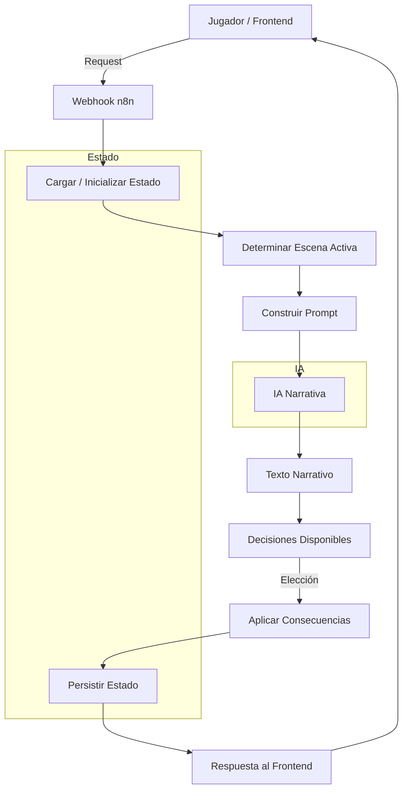
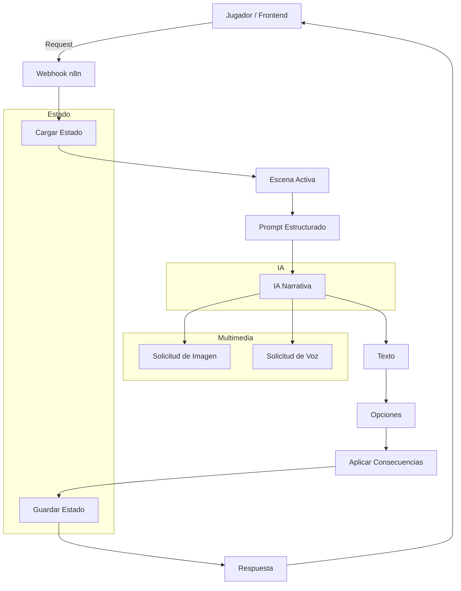
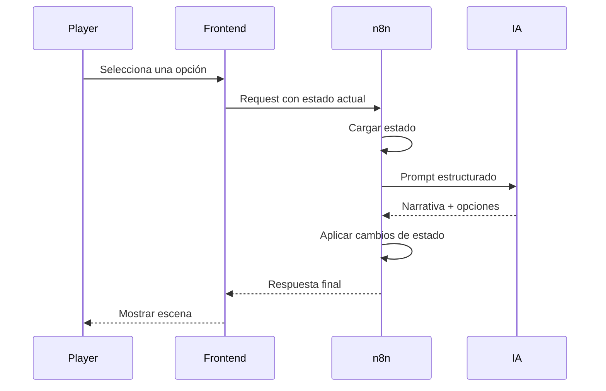

## Visión general del flujo

Este diagrama muestra el flujo principal del sistema a alto nivel, desde la interacción del jugador hasta la respuesta final.

## Flujo narrativo y multimedia

Este diagrama detalla cómo la IA puede solicitar recursos multimedia (imagen y voz), que el motor gestiona de forma desacoplada.

## Secuencia de interacción

Este diagrama muestra la secuencia temporal de una interacción completa, desde que el jugador toma una decisión hasta que se presenta la nueva escena.

